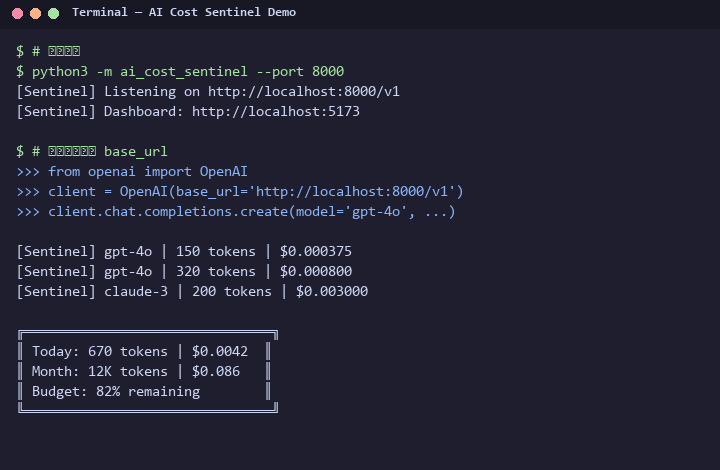

# AI Cost Sentinel

**Lightweight AI API cost tracking proxy — zero code changes, transparently intercept and track every API call.**

Supports all OpenAI-compatible APIs (OpenAI / DeepSeek / Qwen / Zhipu / etc). Automatically records token consumption and cost for every request. Real-time dashboard included.

[🌐 English](README.md) | [中文](README_zh.md)

[](https://github.com/JING04-PRODUCER/ai-cost-sentinel/actions/workflows/python-test.yml)
[](https://www.python.org/)
[](https://fastapi.tiangolo.com/)
[](https://adoptium.net/)
[](LICENSE)


> 💰 **LLM Cost Tracking · Token Monitoring · API Proxy · AI FinOps**

## One-Line Integration

**The only change you need:** update `base_url` to point to the proxy. That's it.

```diff
- client = OpenAI(base_url="https://api.openai.com/v1", api_key="sk-xxx")
+ client = OpenAI(base_url="http://localhost:8000/v1", api_key="sk-xxx")
```

The proxy transparently forwards requests, records token usage, and calculates cost — your app code stays untouched.

## Demo



*Start the proxy → make any API call → cost tracked in real-time.*

## vs Alternatives

| Feature | AI Cost Sentinel | Langfuse | Helicone | Portkey |
|---------|:---:|:---:|:---:|:---:|
| Transparent proxy | ✅ | ❌ | ✅ | ✅ |
| Zero code changes | ✅ | ❌ | ✅ | ✅ |
| Budget alerts | ✅ | ✅ | ❌ | ✅ |
| Self-hosted | ✅ | ✅ | ❌ | ❌ |
| Project tagging | ✅ | ✅ | ✅ | ✅ |
| Dashboard included | ✅ | ✅ | ✅ | ✅ |
| Storage | SQLite (zero-dep) | PostgreSQL | Managed | Managed |

## Architecture

```
Your App ──→ sentinel-proxy (:8000) ──→ Upstream AI API
                  │
                  ├── SQLite (call records + budgets)
                  │
                  └── sentinel-dashboard (:9090) ──→ Web Dashboard
```

## Quick Start

### 1. Start the proxy

```bash
cd sentinel-proxy
pip install -r requirements.txt

# Optional: set upstream API
export UPSTREAM_BASE_URL=https://dashscope.aliyuncs.com/compatible-mode/v1

python main.py  # → http://localhost:8000
```

### 2. Point your app at the proxy

```python
client = OpenAI(base_url="http://localhost:8000/v1", api_key="sk-xxx")
# Everything else stays the same — SDK, methods, parameters
```

### 3. Dashboard (optional)

```bash
cd sentinel-dashboard
mvn spring-boot:run   # → http://localhost:9090
```

## Features

| Feature | Description |
|---------|-------------|
| 🔍 **Transparent Proxy** | No SDK changes, no code wrapping — just change base_url |
| 📊 **Token Counting** | Automatic input/output token tracking per call |
| 💰 **Cost Calculation** | Built-in pricing for 20+ models, auto-converts to USD |
| 📈 **Budget Management** | Set daily/monthly budgets with overage alerts |
| 🌊 **Streaming Support** | Full SSE passthrough for streaming responses |
| 📉 **Visual Dashboard** | Cost trends, model distribution, call history |
| 💾 **Zero-Dependency Storage** | SQLite — no external database required |
| 🏷️ **Project Tagging** | Track costs per project for team usage |

## API Endpoints

| Endpoint | Description |
|----------|-------------|
| `/v1/*` | Transparent proxy — forwards all OpenAI-compatible requests |
| `GET /sentinel/health` | Health check |
| `GET /sentinel/stats?project=&days=30` | Aggregated stats (by model, by day) |
| `GET /sentinel/calls?limit=50` | Recent call records |
| `GET /sentinel/budget?project=` | Budget status |
| `POST /sentinel/budget?project=&daily=&monthly=` | Set budget alerts |
| `GET /sentinel/export/csv?project=&days=30` | Export call records as CSV |
| `GET /sentinel/compare?project=&days=30` | Model cost efficiency comparison |

## Supported Models & Pricing

| Model | Input /1M tokens | Output /1M tokens |
|-------|:-----------------:|:------------------:|
| gpt-4o | $2.50 | $10.00 |
| gpt-4o-mini | $0.15 | $0.60 |
| gpt-4-turbo | $10.00 | $30.00 |
| claude-sonnet-4-6 | $3.00 | $15.00 |
| claude-haiku-4-5 | $0.80 | $4.00 |
| claude-opus-4-7 | $15.00 | $75.00 |
| deepseek-chat | $0.27 | $1.10 |
| deepseek-reasoner | $0.55 | $2.19 |
| qwen-plus | $0.80 | $2.80 |
| qwen-turbo | $0.30 | $0.60 |
| qwen-max | $2.40 | $9.60 |

> Add more models in `sentinel-proxy/config.py` → `MODEL_PRICING`.

## Docker

```bash
docker-compose up -d
# Proxy: http://localhost:8000
# Dashboard: http://localhost:9090
```

## Project Structure

```
ai-cost-sentinel/
├── sentinel-proxy/          # Python FastAPI proxy
│   ├── main.py              # Entry point, route registration
│   ├── config.py            # Pricing table, configuration
│   ├── proxy/
│   │   └── forwarder.py     # Request forwarding + cost calculation
│   ├── tracker/
│   │   └── db.py            # SQLite database operations
│   ├── alerter/
│   │   └── budget.py        # Budget alerts
│   └── requirements.txt
├── sentinel-dashboard/      # Java Spring Boot dashboard
│   ├── pom.xml
│   └── src/main/java/com/costsentinel/
├── tests/
│   └── test_sentinel.py
├── docker-compose.yml
└── README.md
```

## Paired with PromptSlim

**Slim before call → Track after call.** Complete cost optimization loop.

```python
from promptslim import quick_slim
import openai

report = quick_slim(my_prompt)
client = openai.OpenAI(base_url="http://localhost:8000/v1")
response = client.chat.completions.create(
    model="gpt-4o",
    messages=[{"role": "user", "content": report.slimmed}]
)
# Sentinel auto-tracks actual cost, PromptSlim estimates savings
```

## Roadmap

- [x] Transparent proxy with auto-tracking
- [x] 20+ model auto-pricing
- [x] Daily/monthly budget alerts
- [x] CSV export
- [x] Model cost comparison
- [x] Slack webhook notifications
- [x] Spring Boot + Chart.js dashboard
- [ ] PostgreSQL persistence
- [ ] Multi-tenant isolation
- [ ] Grafana integration
- [ ] WeCom / Feishu webhook
- [ ] Export to InfluxDB

## License

MIT — see [LICENSE](LICENSE)
